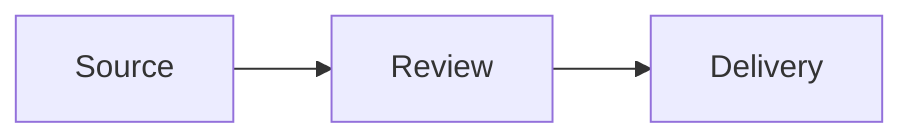

# Merman — Mermaid Diagrams in Typst

**Package**: `@preview/merman:0.1.0`
**Category**: Diagram
**Repository**: <https://github.com/Latias94/merman>

## Description

Merman renders Mermaid source during Typst compilation with a bundled
WebAssembly plugin backed by the headless Rust renderer. It produces an SVG
image, not Typst-native editable shapes. Use it for Mermaid flowcharts,
sequence diagrams, Gantt charts, state diagrams, and other supported Mermaid
families.

## Usage in Touying Slides

Use the package-provided raw-block handler when the source is a fenced Mermaid
block:

````typst
#import "@preview/merman:0.1.0": show-mermaid-blocks

#show raw.where(lang: "mermaid"): show-mermaid-blocks(width: 100%)


````

For one diagram, call `mermaid` directly:

```typst
#import "@preview/merman:0.1.0": mermaid

#mermaid(
  "flowchart LR\n  Source --> Review --> Delivery",
  width: 100%,
  alt: "Source to review to delivery flowchart",
)
```

## Slide Guidance

- Keep the default `error-mode: "panic"` for delivery builds so invalid source
  fails compilation instead of rendering a placeholder.
- Set `width` and, when necessary, `height` or `fit` explicitly for the slide
  composition.
- Prefer plain-text node labels in export-oriented slide templates. HTML label
  markup such as `<br/>` can be flattened differently by the export-safe SVG
  pipeline; use it only after a compile-and-PNG probe confirms the result.
- Do not reuse a fixed SVG `id` across multiple diagrams.
- Inspect small labels in the compiled PNG; an SVG that fits geometrically can
  still be unreadable at presentation distance.

Merman's Typst package and Rust renderer have independent version tracks. Pin
the Typst package version shown above and consult the repository when a diagram
depends on a newly supported Mermaid family.
